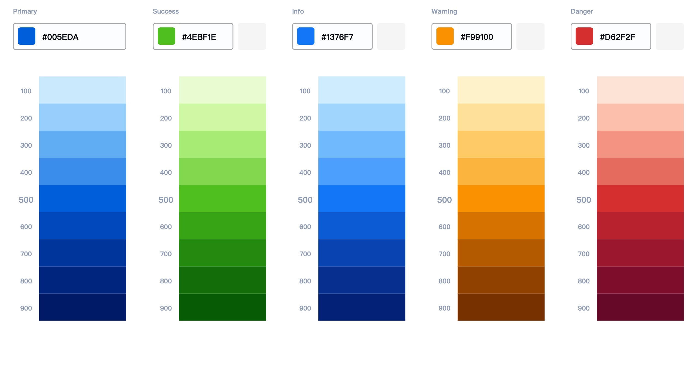

# flutter_nebula

[](https://pub.dartlang.org/packages/flutter_nebula)
[]()
[]()
[](/LICENSE)

Flutter nebula 是 Eva 设计系统的一个Flutter实现。它包含一组以类似方式设计的通用 UI 组件。您专注于业务逻辑，Nebula 负责视觉外观。最棒的是: 主题可以在运行时更改，而不需要重新加载应用程序。

## 🔨 使用

🔩 安装

在 `pubspec.yaml` 添加依赖

```
dependencies:
  flutter_nebula: <last_version>
```

## 📃 文档

主色调：




## 🙏 感谢

本组件库fork自 [equinox](https://github.com/kekland/equinox)
